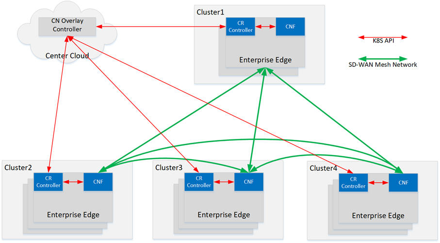
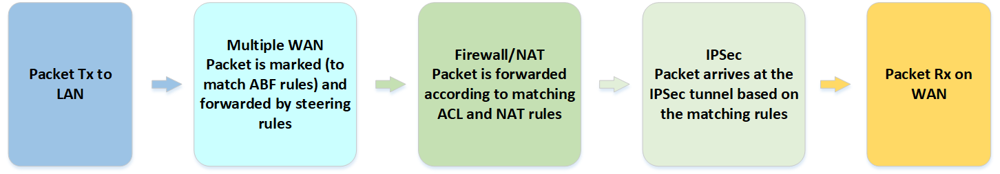
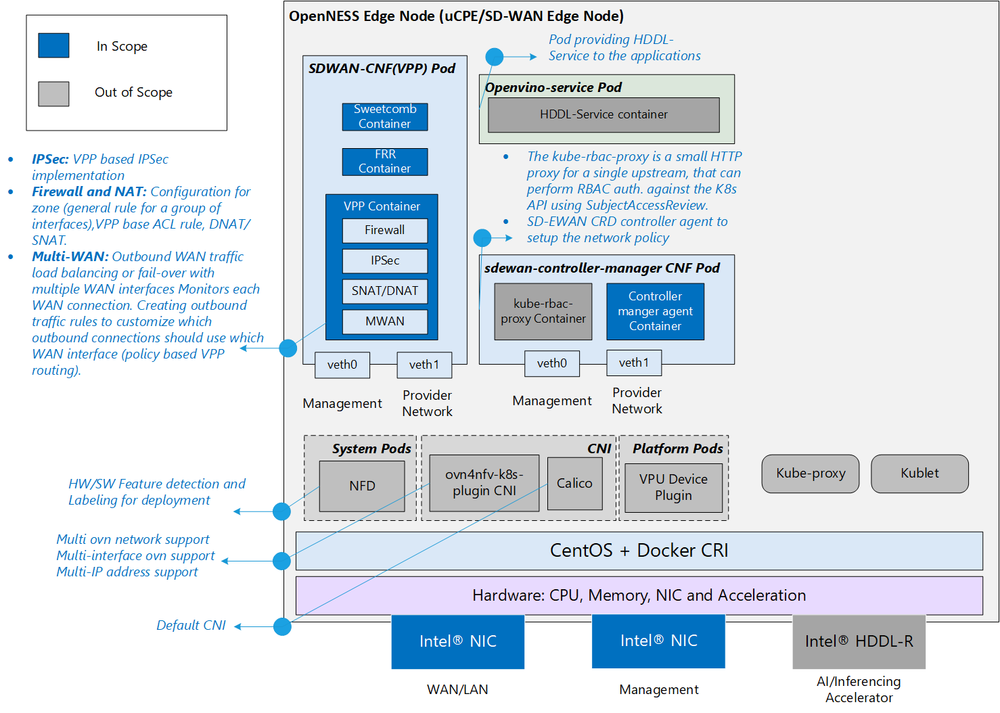
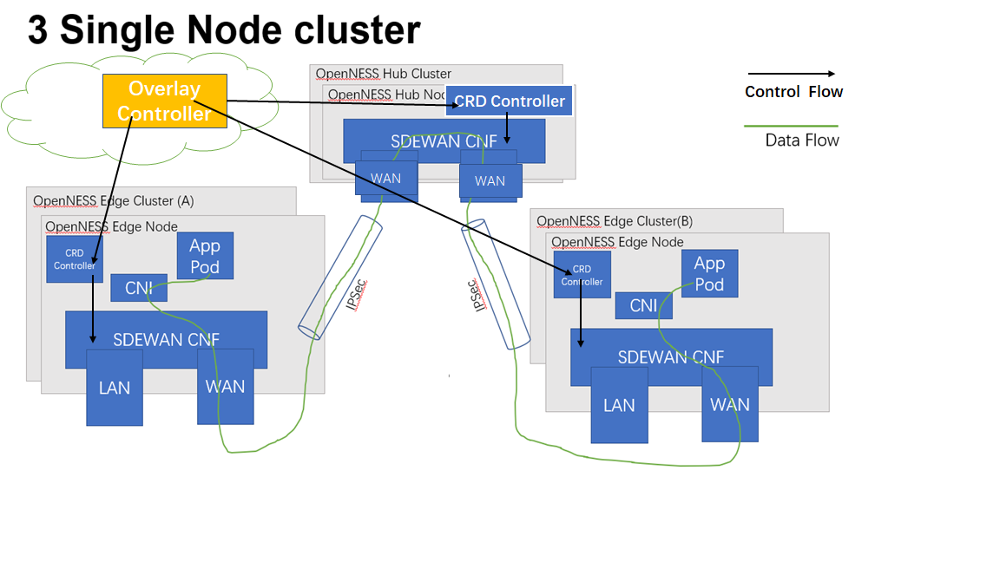
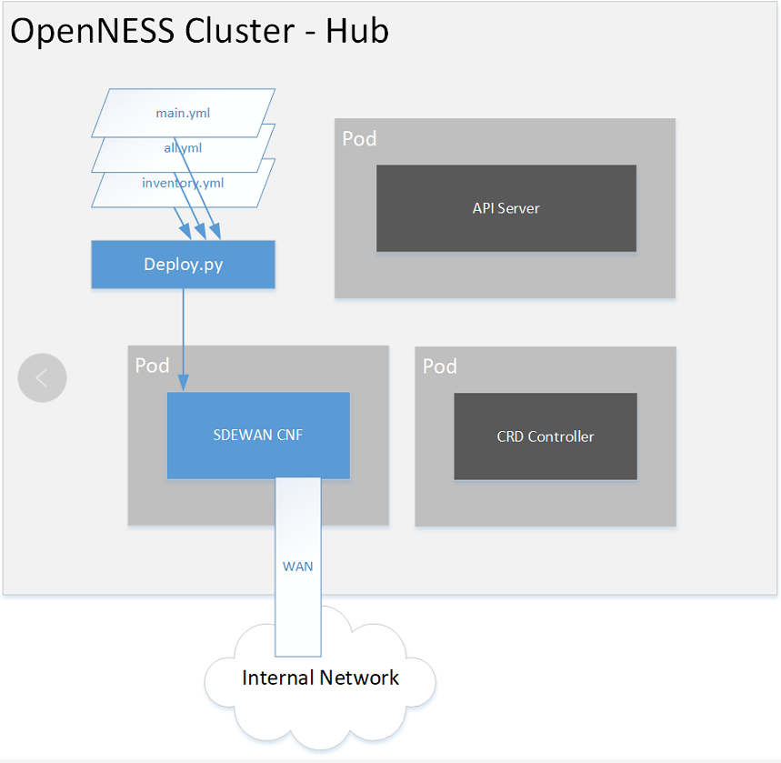
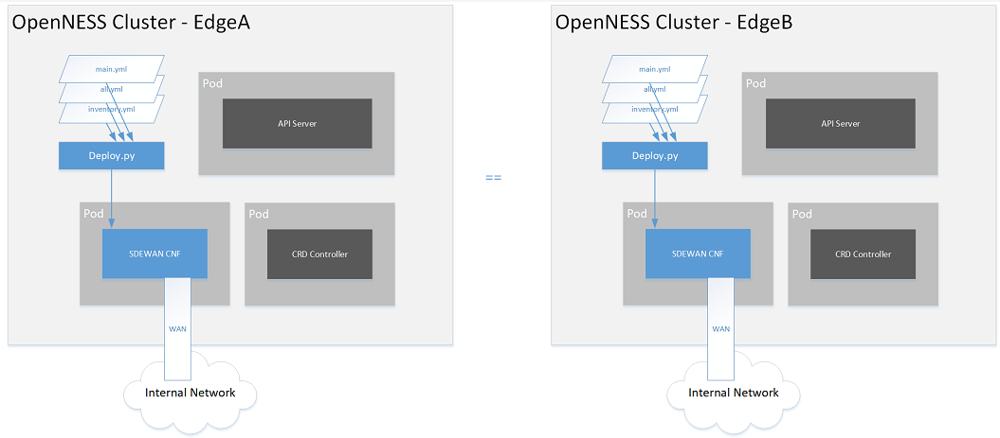

```text
SPDX-License-Identifier: Apache-2.0     
Copyright (c) 2020 Intel Corporation  
```
<!-- omit in toc -->
# Converged Edge Reference Architecture for SD-WAN(vpp based)
- [Introduction](#introduction)
- [SD-WAN Implementation](#sd-wan-implementation)
  - [SD-WAN CNF](#sd-wan-cnf)
  - [SD-WAN CRD Controller](#sd-wan-crd-controller)
  - [Custom Resources (CRs)](#custom-resources-crs)
- [CNF Configuration via CRs](#cnf-configuration-via-openwrt-packages)
  - [IPSec](#ipsec)
- [SD-WAN CNF Packet Flow](#sd-wan-cnf-packet-flow)
- [OpenNESS Integration](#openness-integration)
  - [Goals](#goals)
  - [Networking Implementation](#networking-implementation)
  - [Converged Edge Reference Architectures (CERA)](#converged-edge-reference-architectures-cera)
    - [SD-WAN Edge Reference Architecture](#sd-wan-edge-reference-architecture)
    - [SD-WAN Hub Reference Architecture](#sd-wan-hub-reference-architecture)
- [Deployment And Configuration](#deployment-and-configuration)
  - [E2E Scenarios](#e2e-scenarios)
    - [Hardware Specification](#hardware-specification)
    - [Software Specification](#software-specification)
    - [Scenario 1 : Using Flavor to deploy on Hub Node](#scenario-1-using-flavor-to-deploy-on-hub-node)
    - [Scenario 2 : Using Flavor to deploy on Edge Node](#scenario-2-using-flavor-to-deploy-on-edge-node)
    - [Scenario 3 : Verify Data Flow](#scenario-3-verify-data-flow)
    - [Scenario 4 : Verify Data Flow with 3 Single Cluster Manually](#scenario-4-verify-data-flow-with-3-single-cluster-manually)    
- [Resource Consumption](#resource-consumption)
  - [Methodology](#methodology)
  - [Results](#results)
- [References](#references)
- [Acronyms](#acronyms)
- [Terminology](#terminology)

## Introduction
Software-defined WAN (SD-WAN) introduces a new way to operate a WAN. Firstly,  since it is defined by software, its management can be decoupled from the underlying networking hardware (e.g., routers) and managed in a centralized manner, making it more scalable. Secondly, SD-WAN network functions can now be hosted on Universal Customer Premises Equipment (uCPE), which also host software versions of traditional customer premises equipment. Finally, an SD-WAN can be complemented by edge computing solutions, allowing, for example, latency-sensitive traffic to be steered to edge nodes for local processing, and to allow uCPE functions to be hosted in edge nodes. 

There co-exist two SDEWAN (Software-defined edge WAN) solutions in OpenNESS:
  - one is OpenWrt based solution that was added with OpenNESS 20.12 release [here](https://github.com/otcshare/ido-specs/blob/master/doc/reference-architectures/cera_sdwan.md)
  - the other is VPP/DPDK based solution with high-performance featured leveraging user space network stack.

This document targets the latter only and here is the high-level topo.            


According to Figure-1, in Enterprise Network scenario, the SDEWAN of hub node is defined as a gateway of all branch networks, so high-performance VPP is needed at hub node. For example, an OpenWrt based solution is deployed on edge nodes, while high-performance VPP based solution works on traffic hub nodes that work as bridge among edge nodes. 
 
The SDEWAN CNF supports deployment at Hub node and Edge node. It has the same features either in Hub or Edge node. 


## SD-WAN Implementation
The CERA SD-WAN is based on FD.io(vpp), an Open Source Terabit Software Dataplane. FD.io is a networking technology that can used to build a galaxy of Network Functions. Today it is being used by a several major communication network providers and equipment manufactures to build world-class network functions. More details about FD.io can be found [here](https://fd.io/).

The Fast Data Project (FD.io) Universal Dataplane is a collaborative open source project that aims to significantly establish a high-performance IO services framework for dynamic computing environments,so a number of packages of use in implementing SD-WAN functional elements, which are written as FD.io plugins. These include:

  - IKEv2 (for IKE) [ike](https://fd.io/vppproject/vppfeatures/#ikev2-plugin)
  
  - IPSEC (for IPSec) [ipsec](https://fd.io/vppproject/vppfeatures/#ipsec-crypto-engine-provided-by-intel-ipsecmb-library)

These packages support the following functionality:

  - IPSec tunnels across K8s clusters;  
     
  - Support of multiple types of K8s clusters: 
  
    - K8s clusters having static public IP address, 
  
    - K8s clusters having dynamic public IP address with static FQDN, and 
  
    - K8s clusters with no public IP;


The  SD-WAN implementation uses the following three primary components:

  - SD-WAN Cloud-Native Network Function (CNF) based on vpp packages;
  
  - Custom Resource Definition (CRD) Controller;
  
  - Custom Resource Definitions (CRD).

The CNF contains the vpp services that perform SD-WAN operations. The CRD Controller and CRDs allow Custom Resources (i.e., extensions to Kubernetes APIs) to be created. Together these components allow information to be sent and received, and commands performed, from the Kubernetes Controller to the SD-WAN.

This behavior is described in the following subsections.

### SD-WAN CNF
The SD-WAN CNF is deployed as a pod with external network connections. The CNF runs the Multiple WAN, Firewall, IPSec, and NAT applications, as described in the previous section. The configuration parameters for the CNF include:

  - LAN interface configuration – to create and connect virtual, local networks within the edge cluster (local branch) to the CNF.

  - WAN interface configuration – to initialize interfaces that connect the CNF and connected LANs to the external Internet - WAN and to initialize the traffic rules (e.g., policy, rules) for the interfaces. The external WAN is also referred to in this document as a provider network.

SD-WAN traffic rules and WAN interfaces are configured at runtime via a RESTful API. The CNF implements the RestAPI plugin to provide this API. The API calls are initiated and passed to the CNF by a CRD Controller described in the next paragraph. The API provides the capability to list available SD-WAN services (e.g., Multiple WAN, Firewall, and IPSec), get service status, and execute service operations for adding, viewing, and deleting settings for these services.

### SD-WAN CRD Controller
The CRD Controller (also referred to in the implementation as a Config Agent), interacts with the SD-WAN CNF via RESTful API calls. It monitors CRs applied through K8s APIs and translates them into  API calls that carry the CNF configuration to the CNF instance.

the CRD Controller includes several functions:

  - MWAN Controller, to monitor the Multiple WAN CR;

  - FW Controller, to monitor the Firewall and NAT CR;

  - IPSec Controller, to monitor the IPSec and IKE CRs.


### Custom Resources (CRs)

As explained above, the behavior of the SD-WAN is governed by rules established in the CNF services.
In order to set these rules externally, CRs are defined to allow rules to be transmitted from the Kubernetes API. The CRs are created from the CRDs that are part of the SD-WAN implementation.

The types of rules supported by the CRs are: 

  - Multipule WAN class, with 2 subclasses, mwan3_policy and mwan3_rule. 

  - The firewall class has 5 kinds of rules: firewall_zone, firewall_snat, firewall_dnat, firewall_forwarding, firewall_rule.  

  - IPSec class.
  
  The rules are defined by the OpenWrt services and compatibled with it, and can be found in the OpenWrt documentation, e.g., [here](https://openwrt.org/docs/guide-user/network/wan/multiwan/mwan3).
  
  Each kind of SD-WAN rule corresponds to a CRD, which are used to instantiate the CRs.

In a Kubernetes namespace, with more than one CNF deployment and many SD-WAN rule CRDs, labels are used to correlate a CNF with SD-WAN rule CRDs.

## CNF Configuration via CRs

As explained earlier, the SD-WAN CNF contains a collection of services, implemented by vpp plugins. In this section, the services are described in greater detail.

### IPSec
The SD-WAN leverages IPSec functionality to setup secure tunnels for  Edge-to-WAN and Edge-WAN-Edge (i.e., to interconnect two edges) communication. The SD-WAN uses the vpp IPSec crypto plugin implementation of IPSec. IPsec rules are integrated with the firewall, which enables custom firewall rules. vpp uses the default firewall mechanism to update the firewall rules and injects all the additionally required settings, according to the IPsec configuration from CRD Controller . 

The SD-WAN configures the IPSec site-to-site tunnels to connect edge networks through a hub located in the external network. The hub is a server that acts as a proxy between pairs of edges.  The hub also runs SD-WAN CRD Controller and CNF configured such that it knows how to access SD-WAN CNFs deployed on both edges.  In that case, to create the IPsec tunnel, the WAN interface on the edge is treated as one side of the tunnel, and the connected  WAN interface on the hub is configured as the "responder". Both edges are configured as "initiator".

## SD-WAN CNF Packet Flow

Packets that arrives at the edge come through a WAN link that connects the edge to an external provoder network. This WAN interface should be already configured with traffic rules. If there is an IPSec tunnel created on the WAN interface, the packet enters the IPSec tunnel and is forwarded according to IPSec and Firewall/NAT rules. The packet eventually leaves the CNF via a LAN link connecting the OVN network on the edge. 

The following figure shows the typical packet flow through the SD-WAN CNF for Rx (WAN to LAN) when a packet sent from external network enters the edge cluster:


Packets that attempt to leave the edge come into the CNF through a LAN link attached to the OVN network on the edge cluster. This packet is then marked by the Multiple WAN application. This mark is used by the firewall to apply rules on the packet, and steer it to the proper WAN link used by the IPSec tunnel connecting the CNF to the WAN. The packet enters the IPSec tunnel and leaves the edge through the WAN interface.

The following figure shows the typical packet flow through the SD-WAN CNF for Tx (LAN to WAN), when a packet leaves from the edge cluster to the external network:



## OpenNESS Integration
The previous sections of this document describe the operation of an SD-WAN implemention built from vpp and its various plugins. We now turn to the subject of how the SD-WAN is integrated with OpenNESS.

### Goals
OpenNESS leverages the SD-WAN project to offer SD-WAN service within an on-premise edge, to enable secure and optimized inter-edge data transfer. This functionality is sought by global corporations with  branch offices distributed across many geographical locations, as it creates an optimized WAN between edge locations implemented on top of a public network.

At least one SD-WAN CNF is expected to run on each OpenNESS cluster (as shown in a previous figure), and act as a proxy for edge applications traffic entering and exiting the cluster. The primary task for the CNF is to provide software-defined routes connecting the edge LANs with the (public network) WAN.

Currently, the OpenNESS SD-WAN is intended only for single node clusters, accommodating only one instance of a CNF and a CRD Controller.


### Networking Implementation
OpenNESS deployment featuring SD-WAN implements networking within the cluster with three CNIs: 

  - calico CNI, that acts as the primary CNI. 
  - ovn4nfv k8s plugin CNI  that acts as the secondary CNI. 
  - Multus CNI, that allows for attaching multiple network interfaces to pods, required by the CNF pod. Without Multus, Kubernetes pods could support only one network interface.

The [Calico](https://docs.projectcalico.org/about/about-calico) CNI is used to configure the default network overlay for the OpenNESS cluster. It provides the commuication between the pods of the cluster and acts as the management interface. Calico is considered a lighter solution than Kube-OVN, which currently is the preferable CNI plugin for the primary network in OpenNESS clusters.

The [ovn4nfv-k8s-plugin](https://github.com/opnfv/ovn4nfv-k8s-plugin) is a CNI plugin based on OVN and OpenVSwitch (OVS). It works with the Multus CNI to add multiple interfaces to the pod. If Multus is used, the net1 interface is by convention the OVN default interface that connects to Multus. The other interfaces are added by ovn4nfv-k8s-plugin according to the pod annotation. With ovn4nfv-k8s-plugin, virtual networks can be created at runtime. The CNI plugin also utilises physical interfaces to connect a pod to an external network (provider network). This is particularly important for the SD-WAN CNF. ovn4nfv also enables Service Function Chaining ([SFC](https://github.com/opnfv/ovn4nfv-k8s-plugin/blob/master/demo/sfc-setup/README.md)).

In order for the SD-WAN CNF to act as a proxy between the virtual LANs in the cluster and the WAN, it needs to have  two types of network interfaces configured:

 -  A virtual LAN network on one of the CNF's virtual interfaces. This connects  application pods belonging to the same OVN network in the cluster. The ovn4nfv plugin allows for simplified creation of a virtual OVN network based on the provided configuration. The network is then attached on one of the CNF's interfaces.
 -  A Enterprise network, to connect the CNF pod to an Enterprise LAN network. The Enterprise network is attached to the physical network infrastructure which is takeovered by vpp.
 -  A provider network, to connect the CNF pod to an external network (WAN). The provider network is also attached to the physical network infrastructure which is takeovered by vpp.

### Converged Edge Reference Architectures (CERA)
CERA is a business program that creates and maintains validated reference architectures of edge networks, including both hardware and software elements. The reference architectures are used by ISVs, system integrators, and others to accelerate the development of production edge computing systems.

The OpenNESS project has created a CERA reference architecture for SD-WAN edge and SD-WAN hub. They are used, with OpenNESS, to create a uCPE platform for an SD-WAN CNF on edge and hub accordingly. Even though there is only one implementation of CNF, it can be used for two different purposes, as described below.

#### SD-WAN Edge Reference Architecture
The SD-WAN Edge CERA reference implementation is used to deploy SD-WAN CNF on a single-node edge cluster that will also accomodate enterprize edge applications. The major goal of SD-WAN Edge is to support the creation of a Kubernetes-based platform that boosts the performance of deployed edge applications and reduces resource usage by the Kubernetes system. To accomplish this, the underlying platform must be optimized and made ready to use IA accelerators. OpenNESS provides support for the deployment of OpenVINO™ applications and workloads acceleration with the Intel® Movidius™ VPU HDDL-R add-in card.  SD-WAN Edge also enables the Node Feature Discovery (NFD) building block on the cluster to provide awareness of the nodes’ features to  edge applications. Finally, SD-WAN Edge implements Istio Service Mesh (SM) in the default namespace to connect the edge applications. SM acts as a middleware between  edge applications/services and the OpenNESS platform, and provides abstractions for traffic management, observability, and security of the building blocks in the platform. Istio is a cloud-native service mesh that provides capabilities such as Traffic Management, Security, and Observability uniformly across a network of services. OpenNESS integrates with Istio to reduce the complexity of large scale edge applications, services, and network functions. More information on SM in OpenNESS can be found on the OpenNESS [website](https://openness.org/developers/).


To minimalize resource consumption by the cluster, SD-WAN Edge disables services such as EAA, Edge DNS, and Kafka. Telemetry service stays active for all the Kubernetes deployments.

The following figure shows the system architecture of the SD-WAN Edge Reference Architecture.


#### SD-WAN Hub Reference Architecture
The SD-WAN Hub reference architecture prepares an OpenNESS platform for a single-node cluster that functions primarily as an SD-WAN hub. That cluster will also deploy a SD-WAN CRD Controller and a CNF, but no other corporate applications are expected to run on it. That is why the node does not enable support for an HDDL card or for Network Feature Discovery and Service Mesh.

The Hub is another OpenNESS single-node cluster that acts as a proxy between different edge clusters. The Hub is essential to connect  edges through a WAN when applications within the edge clusters have no public IP addresses, which requires additional routing rules to provide access. These rules can be configured globally on a device acting as a hub for the edge locations. 

The Hub node has two expected use-cases:

- If the edge application wants to access the internet, or an external application wants to access service running in the edge node, the Hub node can act as a gateway with a security policy in force.

- For communication between a pair of edge nodes located at different locations (and in different clusters), if both edge nodes have public IP addresses, then an IP Tunnel can be configured directly between the edge clusters, otherwise the Hub node is required to act as a proxy to enable the communication.

The following figure shows the system architecture of the SD-WAN Hub Reference Architecture.



## Deployment And Configuration 
### E2E Scenarios
Four end-to-end scenarios have been validated to verify deployment of an SD-WAN on OpenNESS. The four scenarios are described in the following sections of this document. 

#### Hardware Specification
- Three physical servers for two single-node sdewan edge clusters and one single-node sdewan hub cluster.
- Xeon (D-2145NT): 1 Core 2 HT, 2G DDR (1G DDR as stretch goal) 
- CPU:
  - _Intel(R) Xeon(R) D-2145NT CPU @ 1.90GHz @8 cores 16 threads_ 
- Memory:
  - _Total 64G DDR4 (16Gx4)_
- NICs:
  - _Intel Corporation Ethernet Connection X722 for 10GbE SFP+_
  - _Intel Corporation Ethernet Controller X710 for 10GbE SFP+_
  - _Intel Corporation I350 Gigabit Network Connection_

#### Software Specification

- Host Operating System
  - _ubuntu 20.04_
- Host Linux Kernel
  - _5.4.0-77-generic_
- BIOS VT-d Configuration
  - _Enable_
- Boot settings
  - _iommu=pt intel_iommu=on_
	
#### Test Suite Topology Overview



**Notes:** 

If there is no WAN Switch/Router equipment in the lab environment, DHCP server can be setting for adjusting the environment *as optional*, dhcp configuration file `cat /etc/dhcp/dhcpd.conf`, like as:

  ```
  ddns-update-style interim;
  ignore client-updates;
  allow booting;
  allow bootp;
  subnet 192.168.123.0 netmask 255.255.255.0 {
  option routers 192.168.123.1;
  option subnet-mask 255.255.255.0;
  option broadcast-address 192.168.123.255;
  range dynamic-bootp 192.168.123.10 192.168.123.100;
  default-lease-time 1200;
  max-lease-time 7200;
  ```

#### Scenario 1 : Using Flavor to deploy on Hub Node

场景1用于验证使用Flavor的方式成功在Hub Node部署SDEWAN CNF.  

在这个场景中，OpenNESS Edge采用单节点集成方式运行，SDEWAN CNF将以POD的方式运行在OpenNESS Hub，同时将对SDEWAN CNF配置WAN接口，验证SDEWAN POD成功运行，并获取到IP地址.


Support flavor to deploy SDEWAN VPP CNF automatically on Hub Node. Hub Single Cluster contains two wan ports, and one management port

A more detailed description of this E2E test is provided under the link in the OpenNESS documentation for this SD-WAN [scenario](https://github.com/otcshare/x-test/blob/pr_tieto_testplan_auguest/test_plans/ned/integration/ts46-sdwan-vpp.md#itpned4601-using-flavor-to-deploy-on-hub-node).

#### Scenario 2 : Using Flavor to deploy on Edge Node
场景2用于验证使用Flavor的方式成功在Edge Node部署SDEWAN CNF.  

在这个场景中，OpenNESS Edge采用单节点集成方式运行，SDEWAN CNF将以POD的方式运行在OpenNESS Edge，同时将对SDEWAN CNF配置WAN接口和LAN接口，验证SDEWAN POD成功运行，并获取到IP地址.


Support flavor to deploy SDEWAN VPP CNF automatically on Edge Nodes. One LAN port and one WAN port are dpdk bound.

A more detailed description of this E2E test is provided under the link in the OpenNESS documentation for this SD-WAN [scenario](https://github.com/otcshare/x-test/blob/pr_tieto_testplan_auguest/test_plans/ned/integration/ts46-sdwan-vpp.md#itpned4602using-flavor-to-deploy-on-edge-node).

#### Scenario 3 : Verify Data Flow with IKEv2 IPSec based on Overlay Controller
场景3在场景1，场景2的基础上进一步验证Overlay network的数据流量通路，采用Hub-Spoke组网模型，需要同时在Hub cluster和两个Edge cluster中部署SDEWAN CNF，通过Overlay Controller使能IKEv2和IPsec功能，验证流量从EdgeA cluster app1 pod，经Hub cluster，到达EdgeB cluster app2 pod的通路可达性。


Verify data flow base on 3 single cluster topology. Ipsec CRs should be configurated on Overlay controller.

A more detailed description of this E2E test is provided under the link in the OpenNESS documentation for this SD-WAN [scenario](https://github.com/otcshare/x-test/blob/pr_tieto_testplan_auguest/test_plans/ned/integration/ts46-sdwan-vpp.md#itpned4603verify-data-flow-with-ikev2-ipsec-based-on-overlay-controller).

#### Scenario 4 : Verify Data Flow with IKEv2 IPSec based on IDO-CEEK
场景4验证方式与场景3相同，但是采用IDO-CEEK部署IPSEC和IKEv2功能。


Data flow from EdgeA -> Hub -> EdgeB through IPSec Tunnel with 3 single cluster test topology. Ipsec CRs should be configurated based on ido-ceek deployment.

A more detailed description of this E2E test is provided under the link in the OpenNESS documentation for this SD-WAN [scenario](https://github.com/otcshare/x-test/blob/pr_tieto_testplan_auguest/test_plans/ned/integration/ts46-sdwan-vpp.md#itpned4604verify-data-flow-with-ikev2-ipsec-based-on-ido-ceek).

## References
- [OpenWrt documentation](https://github.com/otcshare/ido-specs/blob/master/doc/reference-architectures/cera_sdwan.md)
- [FD.io](https://fd.io/)
- [Calico CNI](https://docs.projectcalico.org/about/about-calico)
- [ICN SDEWAN documentation](https://wiki.akraino.org/display/AK/ICN+-+SDEWAN)
- [ovn4nfv k8s plugin documentation](https://github.com/opnfv/ovn4nfv-k8s-plugin)
- [Service Function Chaining (SFC) Setup](https://github.com/opnfv/ovn4nfv-k8s-plugin/blob/master/demo/sfc-setup/README.md)
- [Utilizing a Service Mesh for Edge Services in OpenNESS](https://github.com/otcshare/ido-specs/blob/master/doc/applications/openness_service_mesh.md)
- [Node Feature Discovery support in OpenNESS](https://github.com/otcshare/ido-specs/blob/master/doc/building-blocks/enhanced-platform-awareness/openness-node-feature-discovery.md)


## Acronyms

|             |                                                               |
|-------------|---------------------------------------------------------------|
| API         | Application Programming Interface                             |
| CERA        | Converged Edge Reference Architectures
| CR          | Custom Resource                                               |
| CRD         | Custom Resource Definition                                    |
| CNF         | Cloud-native Network Function                                 |
| DNAT        | Destination Network Address Translation                       |
| HDDL        | High Density Deep Learning                                    |
| IP          | Internet Protocol                                             |
| NAT         | Network Address Translation                                   |
| NFD         | Network Feature Discovery                                     |
| SM          | Service Mesh                                                  |
| SD-WAN      | Software-Defined Wide Area Network                            |
| SNAT        | Source Network Address Translation                            |
| TCP         | Transmission Control Protocol                                 |
| uCPE        | Universal Customer Premise Equipment                          |

## Terminology

| Term | Description |
|:-----: | ----- |
| EWO | <p> Edge WAN Overlay</p>|
| Overlay controller | <p> is a Central Controller provides central control of SDEWAN overlay networks by automatically configuring the SDEWAN CNFs through SDEWAN CRD controller located in edge location clusters and hub clusters</p>|
| EWO Controller | <p>To represent central overlay controller</p>|
| EWO Operator | <p>To represent CRD controller</p>|
| EWO CNF | <p>To represent OpenWRT based CNF. </p>|
| SDEWAN CRD Controller | <p>is implemented as k8s CRD Controller, it manages CRDs (e.g. Firewall related CRDs, Mwan3 related CRDs and IPsec related CRDs etc.) and internally calls SDEWAN Restful API to do CNF configuration. And a remote client (e.g. SDEWAN Central Controller) can manage SDEWAN CNF configuration through creating/updating/deleting SDEWAN CRs. </p>|
| OpenWRT based CNF | <p>The CNF is implemented based on OpenWRT, it enhances OpenWRT Luci web interface with SDEWAN controllers to provide Restful API for network functions configuration and control.</p>|
| VPP based CNF | <p>The CNF is implemented based on VPP, it implements web interface with SDEWAN controllers to provide Restful API for network functions configuration and control.</p>|
